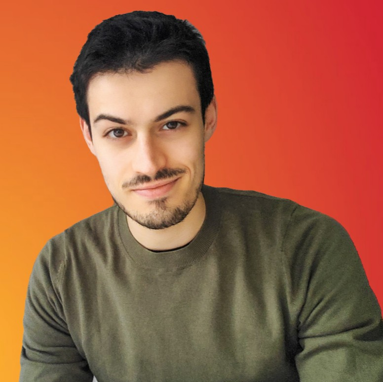

# Welcome to my place!

{ width="300"}

I am a 3rd year **PhD Researcher** in **Computer Vision** & AI at the University of Lille. My research focuses on **neuromorphic engineering, spiking neural networks**, energy-efficient AI, and event cameras. Apart from research, I am interested in data-centric practices.

During my early career, I intend to bring the power of MLOps into Computer Vision.

I also like web and game development so you may possibily see such subjects here.
